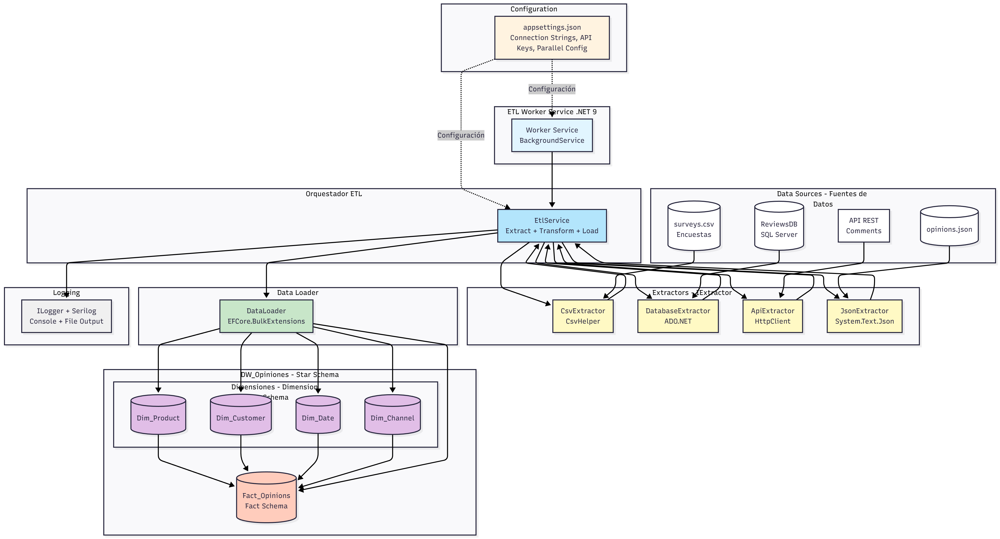
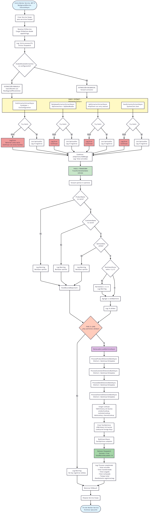

# Customer Opinions ETL System

Sistema **ETL (Extract, Transform, Load)** desarrollado en **.NET 9** para la extracción, transformación y carga de opiniones de clientes desde múltiples fuentes de datos hacia un **Data Warehouse** analítico.

## Información del Proyecto

**Institución:** Universidad
**Asignatura:** Electiva 1
**Estudiante:** Wilmar Gómez de la Cruz (2024-0103)
**Profesor:** Francis Ramírez
**Periodo:** Noviembre 2025

## Descripción

Este proyecto implementa un proceso ETL completo que extrae datos de opiniones de clientes desde **cuatro fuentes distintas**:

* **Archivos CSV** (encuestas internas) - CsvExtractor
* **Base de datos relacional SQL Server** (reseñas web) - DatabaseExtractor
* **API REST** (comentarios de redes sociales) - ApiExtractor
* **Archivos JSON** (opiniones externas) - JsonExtractor

Los datos extraídos son transformados, validados y cargados en un **Data Warehouse** basado en un **modelo dimensional (Star Schema)** para su posterior análisis mediante operaciones BULK optimizadas.

## Objetivos

1. Diseñar una arquitectura orientada a servicios que soporte un proceso ETL escalable.
2. Desarrollar componentes de extracción según el tipo de fuente de datos.
3. Aplicar principios de calidad arquitectónica: rendimiento, seguridad, mantenibilidad y escalabilidad.
4. Documentar el flujo de extracción y justificar las decisiones arquitectónicas.

## Arquitectura

El proyecto implementa el patrón **Clean Architecture** con separación en cuatro capas principales:

```
CustomerOpinionsETL/
│
├── Domain/              # Entidades, DTOs y contratos (IExtractor, IDataLoader)
├── Application/         # Lógica de negocio, EtlService y configuración
├── Infrastructure/      # Extractores, DataLoader, DbContext y persistencia
└── Worker/              # Worker Service (BackgroundService) para ejecución ETL
└── Api/                 # Web API con CQRS (V2)
```

### Diagrama de Arquitectura



El diagrama muestra:
- **Worker Service** con BackgroundService (.NET 9)
- **EtlService** como orquestador principal (Extract + Transform + Load)
- **4 Extractores** implementando el patrón IExtractor:
  - CsvExtractor (CsvHelper)
  - DatabaseExtractor (ADO.NET)
  - ApiExtractor (HttpClient con retry manual)
  - JsonExtractor (System.Text.Json)
- **DataLoader** con EFCore.BulkExtensions para carga masiva
- **Star Schema** del Data Warehouse (DimProduct, DimCustomer, DimDate, DimChannel, FactOpinion)

### Diagrama de Flujo ETL



El flujo completo incluye:
1. **FASE 1 - Extract**: Extracción paralela/secuencial desde 4 fuentes con manejo de errores
2. **FASE 2 - Transform**: Validación y normalización (ProductName, CustomerName, Dates, Sentiment)
3. **FASE 3 - Load**: Procesamiento BULK de dimensiones + lookup sin bucles + BulkInsert de FactOpinions

## Tecnologías Utilizadas

* **.NET 9** - Framework principal
* **C# 13** - Lenguaje de programación
* **Entity Framework Core 9** - ORM para DataLoader
* **ADO.NET** - Acceso a datos de alto rendimiento (DatabaseExtractor)
* **SQL Server** - Base de datos del Data Warehouse
* **CsvHelper** - Lectura de archivos CSV
* **System.Text.Json** - Serialización/deserialización JSON
* **EFCore.BulkExtensions** - Inserciones masivas optimizadas
* **MediatR** - CQRS pattern (V2 API)
* **FluentValidation** - Validación de comandos y queries (V2)
* **Serilog** - Logging estructurado (Console + File)

## Flujo General del Proceso ETL

1. **Extracción:** Obtiene datos desde las cuatro fuentes definidas (paralela o secuencial según configuración).
2. **Transformación:** Normaliza, valida y unifica los registros según reglas de negocio (ProductName, CustomerName, OpinionDate, SentimentScore).
3. **Carga:** Inserta los datos procesados en el Data Warehouse usando operaciones BULK (BulkInsertOrUpdate para dimensiones, BulkInsert para hechos).

## Estructura del Data Warehouse

El modelo de datos implementa un **Esquema Estrella (Star Schema)** con las siguientes tablas:

* **Tabla de Hechos:** `Fact_Opinions` (schema: Fact)
  - Métricas: Rating, SentimentScore, OpinionCount
  - Foreign Keys: ProductKey, CustomerKey, DateKey, ChannelKey

* **Tablas Dimensión** (schema: Dimension):
  - `Dim_Product` - Productos y categorías
  - `Dim_Customer` - Clientes y segmentación
  - `Dim_Date` - Dimensión temporal (Year, Quarter, Month)
  - `Dim_Channel` - Canales de origen (CSV, Database, API, JSON)

## Ramas de Desarrollo

El proyecto sigue un modelo de desarrollo por funcionalidades usando ramas:

### `feature/etl-extraction-v1` (Completada)
- Implementación del proceso ETL completo
- Extracción desde CSV, Base de Datos y API
- Transformación y validación de datos
- Carga BULK optimizada al Data Warehouse
- Arquitectura Clean con separación de DTOs

### `feature/api-v2` (En desarrollo)
- API REST para consulta del Data Warehouse
- Endpoints analíticos para reportes
- Exposición de métricas y tendencias de opiniones
- Documentación con Swagger/OpenAPI

## Ejecución

Para ejecutar el proceso ETL:

```bash
dotnet run --project src/CustomerOpinionsETL.Worker
```

Para ejecutar la API (próximamente):

```bash
dotnet run --project src/CustomerOpinionsETL.Api
```

## Licencia

Proyecto académico desarrollado exclusivamente con fines educativos.

